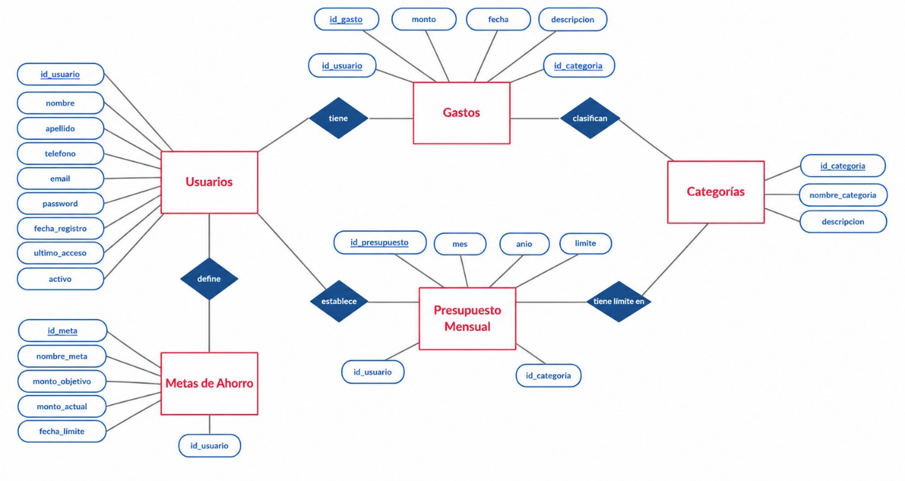

# CoinControl

**Autores:** Omar Daniel Ortega Valtierra, Miguel Angel Roman Padilla  
**Profesor:** Juan Rubén Treviño Tapia  
**Asignatura:** Implementa aplicaciones móviles multiplataforma  

## Objetivo General

Desarrollar una aplicación multiplataforma que permita registrar, categorizar y analizar sus gastos diarios, fomentando la conciencia financiera mediante una interfaz intuitiva y herramientas visuales de seguimiento presupuestario.

## 1. Descripción del problema

Hoy en día, las personas no cuentan con herramientas digitales para el manejo de sus finanzas personales. Este problema se desarrolla en estos puntos:

- No tienen donde registrar gastos diarios de manera rápida y sencilla, causando el mal gasto u olvidos de estas cuentas.
- No organizan sus gastos, dejando la información desorganizada y causando fragmentación de información.
- No dan seguimiento a metas de ahorro, lo que desmotiva a los usuarios al sentir su economía sin avance.

## 2. Entidades

Para solucionar este problema, identificamos las siguientes entidades que deben ser gestionadas por una base de datos relacional:

- **Usuarios:** Personas que utilizan la aplicación y necesitan almacenar su información personal y credenciales de acceso.
- **Gastos:** Registros de cada egreso realizado por un usuario, incluyendo monto, fecha y descripción.
- **Categorías:** Clasificaciones predefinidas o personalizables que permiten agrupar los gastos (ej. alimentos, transporte, ocio).
- **Presupuesto Mensual:** Límites de gasto que un usuario asigna a cada categoría para un mes y año específico.
- **Metas de Ahorro:** Objetivos financieros que los usuarios desean alcanzar, con un monto objetivo, progreso actual y fecha límite.

Estas entidades se relacionan directamente ya que el problema a solucionar requiere todas.

## 3. Justificación de elementos de la base de datos

La base de datos fue diseñada para cumplir con las funciones requeridas para la aplicación.

### Tabla `usuarios`

- **Justificación:** Es el núcleo de la aplicación. Cada usuario debe tener un registro único que almacene su identidad (`nombre`, `apellido`), datos de contacto (`email`, `teléfono`) y credenciales (`password`). Los campos `fecha_registro`, `ultimo_acceso` y `activo` permiten gestionar la seguridad y el análisis de uso de la plataforma.

### Tabla `categorias`

- **Justificación:** Permite dividir los gastos y presupuestos de manera bien organizada mediante: `id_categoria`, `nombre_categoria`, `descripción`. Al separar la categoría como un grupo independiente, se evita repetir el nombre de categoría.

### Tabla `gastos`

- **Justificación:** Almacena cada transacción de egreso. Los campos `monto`, `fecha` y `descripción` capturan la información principal de cada gasto. Las claves foráneas `id_usuario` y `id_categoria` vinculan el gasto a una persona y a una clasificación específica, permitiendo consultas.

### Tabla `presupuesto_mensual`

- **Justificación:** Respalda la funcionalidad de "presupuesto mensual por categoría". Los campos `mes`, `anio` y `limite` permiten definir cuánto planea gastar un usuario en cada categoría durante un periodo específico.

### Tabla `metas_ahorro`

- **Justificación:** Da soporte a la función de "establecer metas de ahorro". Los campos `nombre_meta`, `monto_objetivo`, `monto_actual` y `fecha_limite` permiten al usuario definir un objetivo, ir actualizando su progreso y visualizar si alcanzará la meta a tiempo.

## 4. Diagrama Entidad - Relación

- Un usuario puede tener muchos gastos. Un gasto pertenece a un solo usuario.
- Un usuario puede definir muchos presupuestos (uno por categoría/mes). Un presupuesto pertenece a un solo usuario.
- Un usuario puede tener muchas metas de ahorro. Una meta pertenece a un solo usuario.
- Una categoría puede estar asociada a muchos gastos. Un gasto tiene una sola categoría.
- Una categoría puede aparecer en muchos presupuestos (diferentes usuarios/meses). Un presupuesto corresponde a una sola categoría.****

# Omar Daniel Ortega Valtierra
## Numero de control: 23308060610674
## Correo electronico: 23308060610674@cetis61.edu.mx

# Miguel Angel Roman Padilla 
## Numero de control: 23308060610314
## Correo electronico: 23308060610314@cetis61.edu.mx

## Especialidad: Programacion 
## Grupo: 6D
